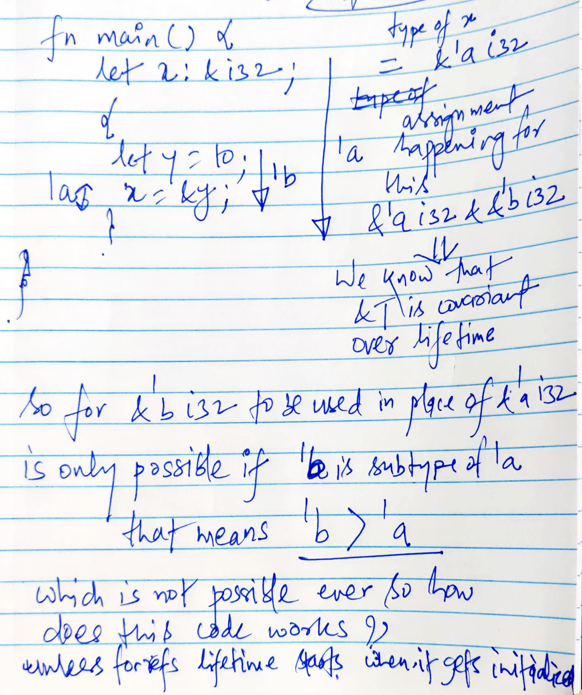

[why explicit lifetime is required if compiler can infer from source](https://stackoverflow.com/questions/31609137/why-are-explicit-lifetimes-needed-in-rust)

# Lifetimes:
**lifetime in these three scenario**  
1. lifetime in usual code blocks
2. lifetime of returned references and reference arguments from function which have >=2 arguments passed
3. references in struct

## lifetime in normal code blocks:
each let call will produce an implicit lifetime for that variable
for owned variables - this lifetime will be as long as scope of variable i.e. till drop is not called usually the block
for references - this will be as long as when reference is last used
TODO: how can we make the below example good looking

```rust
fn sample() {
    //this is let statement so say it got lifetime 'a
    let x: &i32;
    {
    let y = 10; //this gets say lifetime 'b
    x = &y; //this is where reference var x is used last 'a ends here
    //'b ends here as owned variable y goes out of scope
    }
}
```

## subtyping in terms of lifetimes:
interesting fact we would think that
&T and &T are same type aren't they
but what about now
&'a T and &'b T  - now lifetime which is usually hidden is given

so what about subtyping then -
it tells that if &'a T and &'b T can be used in others place
in terms of lifetime we say if lifetime is bigger it is subtype of other
so if 'a > 'b
then 'a is subtype of 'b

## one more new concept variance:
variance tells where we can use subtypes/supertypes
three types of variance
1. covariant - if covariant over something then subtypes can be used in place of it
2. contravariant - if contravariant over something then supertypes can be used in place of it
3. invariant - if invariant over something then you can't use anything else in place of it

rule for variance:

|   |                 |     'a    |         T         |     U     |
|---|-----------------|:---------:|:-----------------:|:---------:|
| * | `&'a T `        | covariant | covariant         |           |
| * | `&'a mut T`     | covariant | invariant         |           |
| * | `Box<T>`        |           | covariant         |           |
|   | `Vec<T>`        |           | covariant         |           |
| * | `UnsafeCell<T>` |           | invariant         |           |
|   | `Cell<T>`       |           | invariant         |           |
| * | `fn(T) -> U`    |           | **contra**variant | covariant |
|   | `*const T`      |           | covariant         |           |
|   | `*mut T`        |           | invariant         |           |
*/



## what it means to give lifetime in functions
fn x<'a>(a: &'a i32) -> &'a i32  
what it means for explicit lifetime 'a length  
I think it means 'a is as big as body of the function  
so for any &'a T only &'b T can be used  
if 'b > 'a can only be satisfied if 'b is created outside of the function not inside (anything created inside will have smaller
lifetime than function itself)  

**write some examples and test the theory**
fn x<'a, T>(&'a mut T, T)  => a famous example in rust nomicon


## why struct require explicit lifetime for its fields

```rust
//'a lifetime can only mean that it should be as big as lifetime of struct
#[derive(Debug)]
struct Human<'a>{
    name: &'a str,
    age: &'a i32
}

fn main(){
    //say a gets lifetime 'b
    let a = 10;
    //let statement for struct so say struct implicitly gets a lifetime 'c 
    //here &a will mean &'b a actually
    //since &T is covariant over its lifetime so
    //for use as age 'b > 'c ('c is also equal to our explicit lifetime 'a)
    let b = Human{name: "Hello World", age: &a};
    print!{"{:?}",b};
}
```